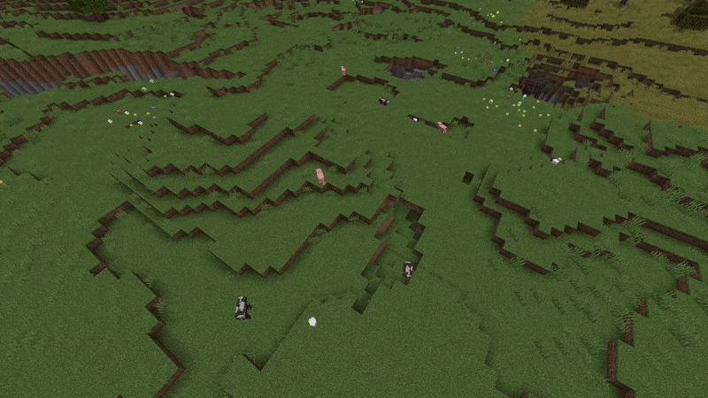

# Bouncy Animals
This is a simple mod that replicates the 2011-era behavior of animals jumping if there is a block in front of them while they are moving laterally. It's not _exactly_ 1-to-1 with the beta behavior because they still have their modern pathfinding, but it's pretty close.

There are config options for which mobs jump, how frequently they jump, and an additional, optional feature that makes them jump completely randomly.

*This mod was created as a commission. I would like to port this feature to Train's Tweaks (1.21+) eventually.*